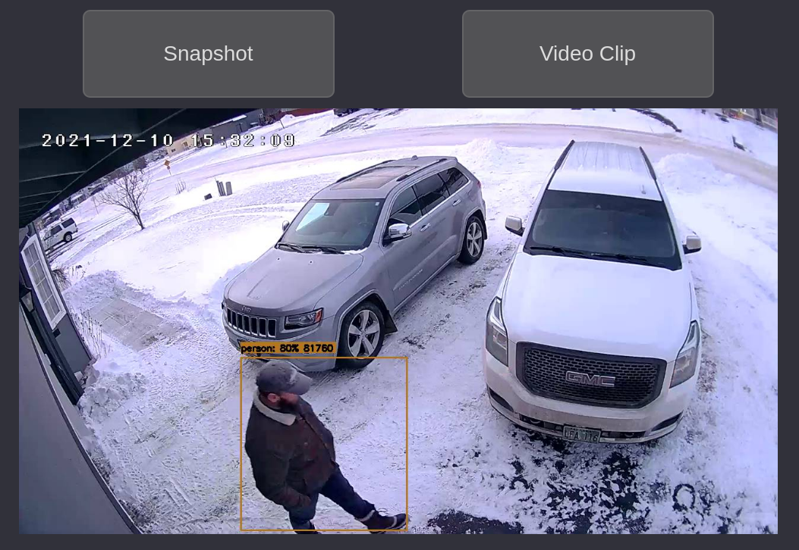
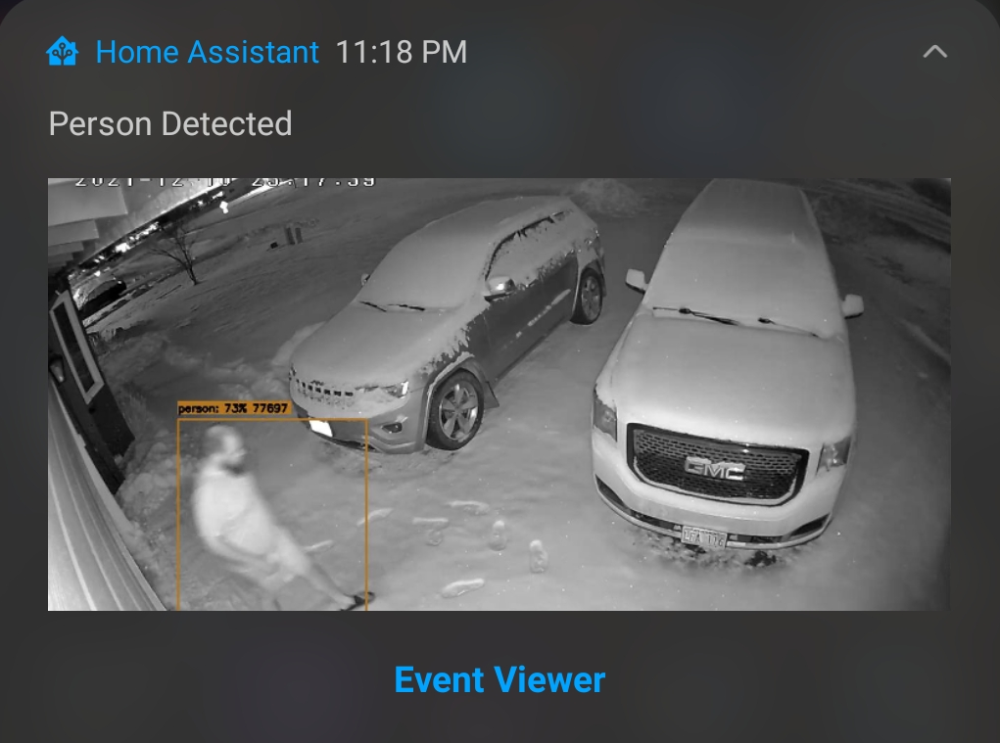

# HassPyFrigate
## Python 3 CGI script for better looking notifications


# SERVER SIDE SETUP
 * This will run on a standard installation of Apache2.  Place /html/cgi-bin/hasspyfrigate.py in your cgi-bin location 
#### (/usr/lib/cgi-bin is the default on Ubuntu)
* Place /html/css/hasspyfrigate.css into any web accessible folder (<html_root>/css preferred)

# Home Assistant Automations

## Android Companion App Notification
#### Example Android Actionable Notification
Click on "Event Viewer" to view HassPyFrigate Event Viewer

The following Automation will send an actionable notification to the android companion app (Should work with iOS as well)
```
alias: HassPyFrigate Alert
description: HassPyFrigate Object Detection Alerts Using Frigate
trigger:
  - platform: mqtt
    topic: frigate/events
condition:
  - condition: template
    value_template: '{{ trigger.payload_json["type"] == "end" }}'
  - condition: template
    value_template: |-
      {{ trigger.payload_json["after"]["label"] == "person" or 
         trigger.payload_json["after"]["label"] == "car" or
         trigger.payload_json["after"]["label"] == "bird" or
         trigger.payload_json["after"]["label"] == "dog" or
         trigger.payload_json["after"]["label"] == "cat" or
         trigger.payload_json["after"]["label"] == "bear" or
         trigger.payload_json["after"]["label"] == "horse" 
      }}
action:
  - service: notify.mobile_app_sm_g986u1
    data:
      message: '{{ trigger.payload_json["after"]["label"] | title }} Detected'
      data:
        notification_icon: mdi:cctv
        ttl: 0
        priority: high
        sticky: true
        actions:
          - action: URI
            title: Snapshot
            uri: >-
              http://YOUR_SERVER/cgi-bin/hasspyfrigate.py?id={{trigger.payload_json['after']['id']}}&camera={{trigger.payload_json['after']['camera']}}&bbox=true&url=https://hass.jeandr.net/api/frigate/notifications/&time={{trigger.payload_json['after']['start_time']}}&css=../css/hasspyfrigate.css#
        image: >-
          /api/frigate/notifications/{{trigger.payload_json['after']['id']}}/snapshot.jpg?bbox=1
        tag: '{{trigger.payload_json["after"]["id"]}}'
        alert_once: true
mode: single

```

# Planned Features:
  - Notification History (Independent from Frigate)
    - Save Notification
      - This will live outside Frigate and permanently save:
        - Event Data
        - Snapshot
        - Video Clip
    - Delete Notification
  - SQLite database connector
  - External SQL servers (maybe)
