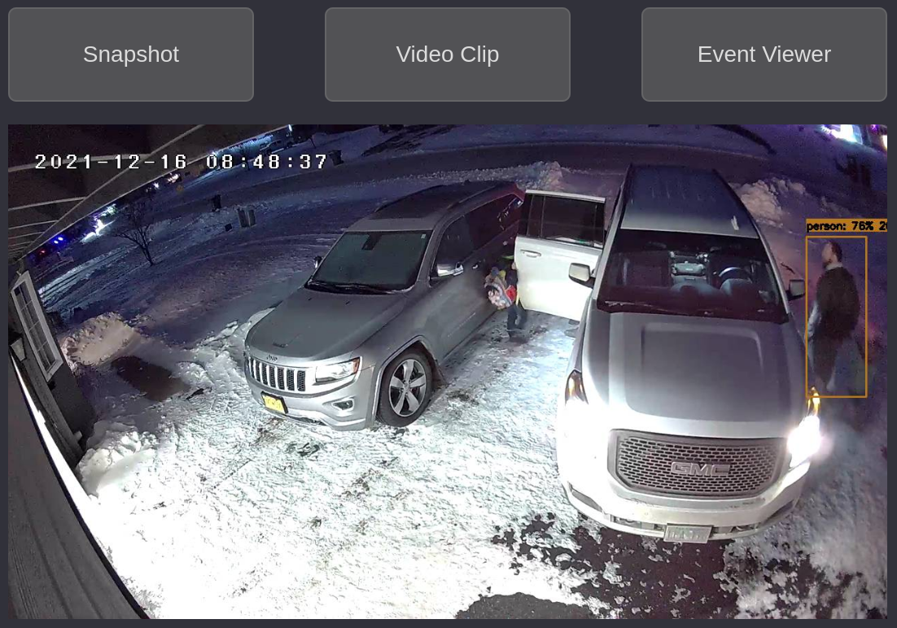
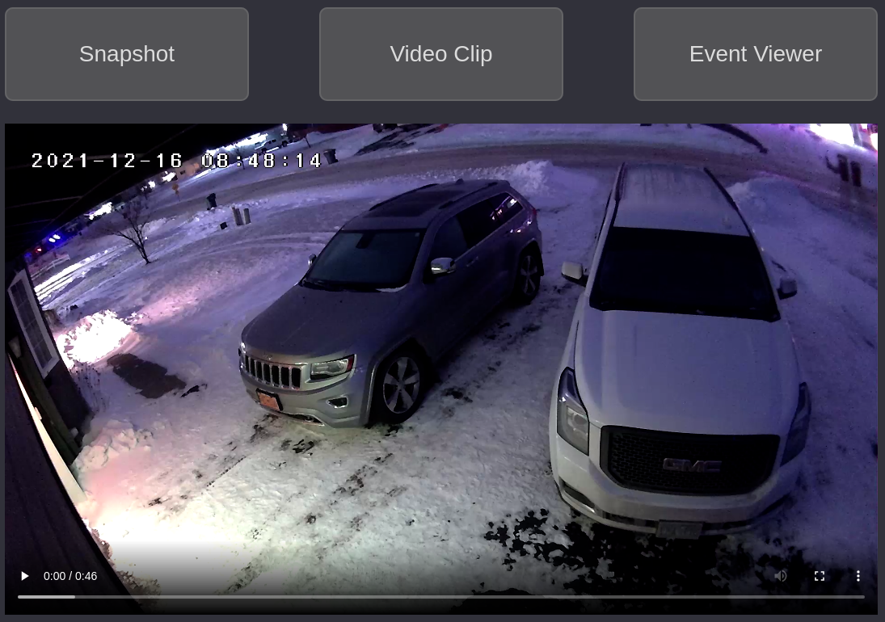
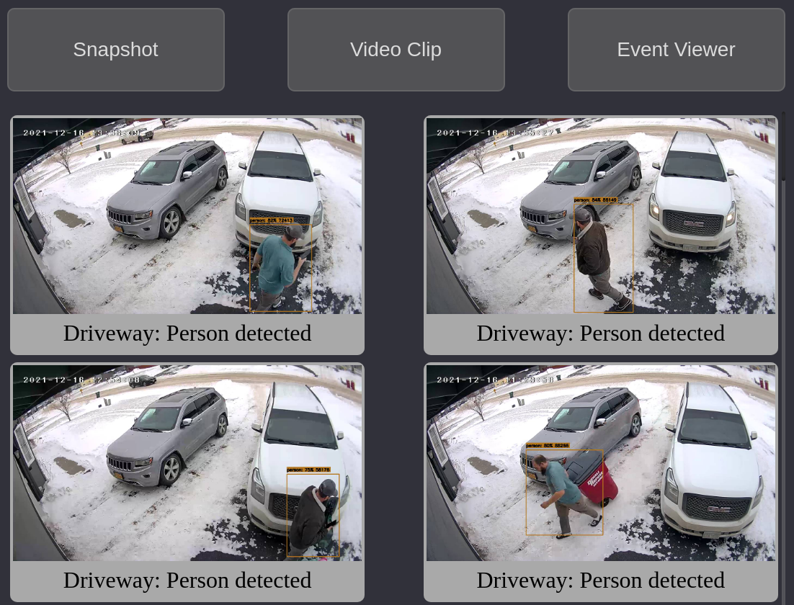

# HassPyFrigate
## Python 3 CGI script for better looking notifications

#### NOTE: I am a fairly novice Python developer.  Any tips/tricks/additions you feel are needed are MORE than welcome. Please fork and submit a pull request.

#### PRERELEASE CONDITION: This is usable, however there are definitely bugs, security vulnerabilities, and severe "hackiness" going on at this point.

## Features:
- [x] Customizable CSS for themeing
- [x] [RESTful Interface](#home-assistant-setup)
- [x] SQLite backend
- [x] JSON formatted configuration files
  - [ ] Convert to YAML❓
- [x] [Event Viewer](#event-viewer)
- [x] [Snapshot Viewer](#snapshot-view)
- [x] [Clip Viewer](#clip-view)
- [ ] Independent Storage of Snapshots and Clips
- [ ] MariaDB/Postgres backends❓

# Snapshot View


# Clip View


# Event Viewer


# SERVER SIDE SETUP
- This will run on a standard installation of Apache2.  Place /html/cgi-bin/hasspyfrigate.py in your cgi-bin location 
  - (/usr/lib/cgi-bin is the default on Ubuntu)
- Place /html/css/hasspyfrigate.css into any web accessible folder (<html_root>/css is the default location)
- Place db folder in /var/www and chmod 0770 and chown to apache2 group (www-data on Ubuntu)
- edit /var/www/db/json/config.json to your liking
  - NOTE: /var/www/db/hasspyfrigate.sqlite will be created at first run.
  - NOTE: setting debug to true will output to stdout error log.
    - This will be in /var/log/apache2/error.log on Ubuntu.

# Home Assistant Setup
# RESTful Command
Add the following to your configuration.yaml in Home Assistant:
```
rest_command:
  hasspyfrigate:
    url: http(s)://<HASSPYFRIGATE_URL/cgi-bin/hasspyrest.py
    method: POST
    headers:
      accept: "application/json, text/html"
      user-agent: "Mozilla/5.0 {{ useragent }}"
    payload: '{
      "table": "events",
      "debug": "1",
      "function": "INSERT",
      "columns" : {
      "event_id": "{{event_id}}",
      "url": "{{url}}",
      "camera": "{{camera}}",
      "type": "{{type}}",
      "bbox": "{{bbox}}"
      }
      }'
    content_type: "application/json; charset=utf-8"
```

# Android Companion App Notification
#### Example Android Actionable Notification
Click on "Event Viewer" to view HassPyFrigate Event Viewer

The following Automation will send an actionable notification to the android companion app (Should work with iOS as well)
Include the following in your automations.yaml file in Home Assistant
```
- id: 'hasspyfrigate'
  alias: HassPyFrigate
  description: Object Detection Alerts Using HassPyFrigate
  trigger:
  - platform: mqtt
    topic: frigate/events
  condition:
  - condition: template
    value_template: '{{ trigger.payload_json["type"] == "end" }}'
  - condition: template
    value_template: "{{ trigger.payload_json[\"after\"][\"label\"] == \"person\" or\n\
      \   trigger.payload_json[\"after\"][\"label\"] == \"bird\" or\n   trigger.payload_json[\"\
      after\"][\"label\"] == \"dog\" or\n   trigger.payload_json[\"after\"][\"label\"\
      ] == \"cat\" or\n   trigger.payload_json[\"after\"][\"label\"] == \"bear\" or\n\
      \   trigger.payload_json[\"after\"][\"label\"] == \"horse\" \n}}"
  action:
  - service: notify.mobile_app_sg20plus
    data:
      message: '{{ trigger.payload_json["after"]["label"] | title }} Detected'
      data:
        notification_icon: mdi:cctv
        ttl: 0
        priority: high
        sticky: true
        actions:
        - action: URI
          title: Event Viewer
          uri: http(s)://<HOME_ASSISTANT_URL/cgi-bin/hasspyfrigate.py?id={{trigger.payload_json['after']['id']}}&camera={{trigger.payload_json['after']['camera']}}&bbox=true
        image: /api/frigate/notifications/{{trigger.payload_json['after']['id']}}/snapshot.jpg?bbox=1
        tag: '{{trigger.payload_json["after"]["id"]}}'
        alert_once: true
  - service: rest_command.hasspyfrigate
    data:
      event_id: '{{trigger.payload_json[''after''][''id'']}}'
      camera: '{{trigger.payload_json[''after''][''camera'']}}'
      type: '{{ trigger.payload_json[''after''][''label''] | title }}'
      bbox: 1
  mode: single

```

# Planned Features:
- [x] Notification History (Independent from Frigate) ✔
- [x] SQLite database connector ✔️
- [ ] Acknowledge Notification (Progress made, ack field is in the database, just need to make the UI.
- [ ] Delete Notification
- [ ] Save independent copy from Frigate of:
  - [ ] Event Data
  - [ ] Snapshot
  - [ ] Video Clip

- [ ] External SQL servers (maybe) ❓
